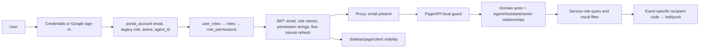
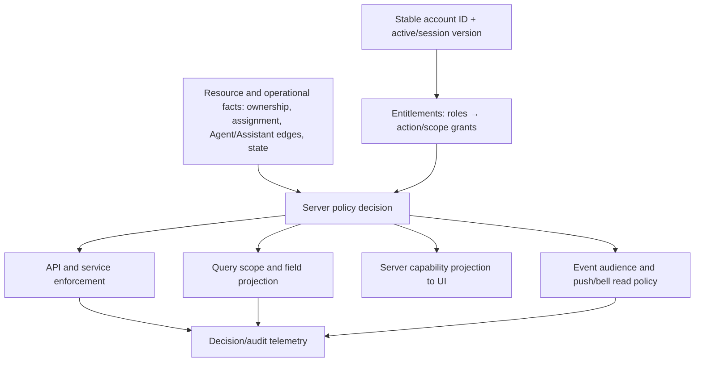

# Authorization architecture audit and migration plan

Date: 2026-09-25. Scope: `agent-portal` application source and committed Supabase schema/rollouts. This is a static code audit; it does **not** verify current production role assignments, deployed database grants, or actual exploit occurrences. No application behavior was changed. File references below are repository-relative and line numbers refer to the audited checkout.

## Executive decision

Make **versioned RBAC grants the authority for entitlement**, and make one server-side policy layer the authority for decisions. Keep task Agent selection, Assistant delegation, assignment queues, resource ownership, and lead distribution as domain facts; feed those facts into policies. The question for code should become `authorize(principal, action, resource)` or `scopeQuery(principal, action)`, with a matching UI capability projection. A newly composed role can then use existing actions and scopes without code edits. Adding a *new kind of action or relationship* still requires a reviewed policy implementation and deployment.

The highest priority is to close existing authorization gaps during the first migration wave: role-management privilege delegation, email-bound sessions and delayed deactivation, notification disclosure beyond resource scope, missing task-permission check on the overview API, read permission granting registration writes, and unverified RLS/grants on newer tables. These are findings from code paths, with deployment-dependent cases marked below.

## 1. Investigation method and boundaries

The investigation traced login and JWT refresh, RBAC schema and management APIs, authenticated pages and navigation, API guards, service-role Supabase queries, task/enrollment/lead/registration/dashboard/time-off/automation policies, configuration pages, assignment SQL, cron routes, notifications, Web Push, and Supabase Realtime. Search included role literals, permission constants, account and Agent/Assistant metadata, recipient selection, query filters, and consumers of the helper functions—not only RBAC-named files. The repository has 112 files under `src/app/api` and 699 files under `src` in this checkout. Representative high-risk direct-record and list paths were traced end to end; this is not a proof that every endpoint or deployed database object is safe.

`supabase/schema.sql:6199-6271` uses RLS to restrict direct client table access, while `src/lib/supabase.ts:3-11` gives server code a service-role client that bypasses it. Consequently API/service guards and data queries are the effective application boundary. No tenant/organization identifier or tenant policy was found in the audited core account/resource model; do not describe today's system as tenant isolated. A future multi-tenant release needs tenant identity and database predicates before onboarding multiple organizations.

## 2. Current architecture and end-to-end path



1. Credentials login checks `portal_account.is_active` and password; Google login may create a default legacy Agent account for `AUTH_GOOGLE_ALLOWED_DOMAIN` (`src/auth.ts:36-135`). That environment setting controls provisioning, not a grant.
2. `getUserAccessByEmail` joins account, active RBAC roles, and permission grants; it also computes a legacy `admin|agent` value from `portal_account.role` **or** the Admin/Super Admin role names (`src/lib/rbac/access.ts:28-69`). `user_roles` is limited to one role per account by SQL unique index, despite array-shaped code (`supabase/schema.sql:67-102,332-351`).
3. JWT/session contains email, legacy role, role names, permission strings, and `agentId`, but no stable account ID or active flag; grants refresh by email every five minutes (`src/auth.ts:138-196`; `src/types/next-auth.d.ts:4-29`). Proxy checks email presence, not current grants or active account (`src/proxy.ts:15-21`; `src/auth.config.ts:25-33`).
4. A page may use `requirePermission` (`src/lib/rbac/server.ts:19-44`) and navigation uses exact permission membership (`src/lib/rbac/client.ts:1-14`; `src/lib/rbac/routes.ts:10-90`). API routes each implement their own gate. Domain helpers then add role-name, relationship, and state rules. The Supabase admin client executes the resulting query, so a missed scope is consequential.
5. Notifications resolve recipients independently in event routes and cron, store recipient **email** in three tables, then merge/enrich through the bell API without a resource-policy recheck (`src/lib/tasks/notifications.ts:89-130`; `src/lib/enrollment/notifications.ts:14-41`; `src/lib/time-off/notifications.ts:64-99`; `src/app/api/tasks/notifications/route.ts:19-23,274-425`). Push selects subscriptions by email (`src/lib/notifications/push-server.ts:76-150`).

The role catalog is composable only within 21 predefined keys (`src/lib/rbac/permissions.ts:1-211`; `supabase/schema.sql:163-191`). The schema deletes keys outside its allowlist and resets Admin/Agent grants if reapplied (`supabase/schema.sql:219-242,293-319`). Role Manager configures grants but cannot introduce an action, scope, or policy by itself. The two legacy account roles remain constrained to `admin|agent` (`supabase/schema.sql:14-51`).

## 3. Authorization dependency map: competing sources of truth

| Source | Decisions it controls today | Evidence | Target authority |
|---|---|---|---|
| RBAC tables and permission catalog | Menu/page/API entry, some manager and export gates, Time Off, management access | `supabase/schema.sql:67-102,163-191`; `src/lib/rbac/access.ts:56-69`; `src/lib/rbac/permissions.ts:1-23` | Canonical entitlement grants, versioned action catalog |
| Legacy account column and role names | Admin scope, protected-role/last-admin logic, default role, assignee labels, QC/escalation audience | `src/lib/tasks/access.ts:16-50`; `src/lib/leads/access.ts:29-56`; `src/lib/tasks/membership.ts:184-196`; `src/lib/rbac/system-roles.ts:17-35` | Compatibility projection, then remove from decisions; protected/default IDs |
| Backend domain code and query filters | Per-record view/edit/assign, backlog, shared queues, exports, AI scope | `src/lib/tasks/access.ts:91-189`; `src/lib/enrollment/scope.ts:37-171`; `src/lib/leads/queries.ts:77-119`; `src/lib/ai/health-query-builder.ts:45-55` | Central policies plus composable query scopes |
| Frontend/page/client conditions | Links, tabs, controls, sometimes server component payload | `src/app/(authed)/_components/Sidebar.tsx:147-152`; `src/app/(authed)/config/page.tsx:67-139`; `src/app/(authed)/_components/TopBar.tsx:105-113` | Server-derived capability projection; backend remains authoritative |
| Operational tables and resource fields | Selected Agent, Assistant edges, task assignee/participant, enrollment owner/caller, lead owner/weights, queue eligibility | `supabase/schema.sql:3453-3522`; `src/lib/tasks/membership.ts:98-135`; `src/lib/leads/auto-assign.ts:94-146` | Domain facts consumed by policy; separate management/audit |
| Notification/event code and preferences | Who receives task, enrollment, Time Off alerts; push opt-in and payload | `src/app/api/tasks/route.ts:389-425`; `src/app/api/enrollment/[id]/comments/route.ts:123-166`; `src/lib/notifications/push-server.ts:76-150` | Central event audience policy, resource access gate, delivery preference |
| Portal/table configuration | Column layout/default visibility, custom options, Agent/Assistant roster, lead settings | `src/lib/table-config/access.ts:44-101`; `src/app/(authed)/config/page.tsx:67-139`; `src/lib/table-config/types.ts` | Display/config state remains domain data; config mutations use policies |
| Environment/external scripts | Google domain provisioning, cron secret, Apps Script tooling, realtime topic secret | `src/auth.ts:97-135`; `src/lib/cron-auth.ts:9-24`; `src/lib/tasks/realtime.ts:27-62` | Authentication/integration controls, never replacement for user authorization |
| SQL seed/rollouts | Reset grants, name-based assignment eligibility and default grants | `supabase/schema.sql:293-319,3657-3713`; `supabase/rollouts/2026-09-01-lead-role-grants.sql:20-53` | Additive registry migrations; no repeated role-name overwrite |

There are multiple competing sources. For example `task.manage` alone does not yield global task scope, but it **does** make a user a task-created notification recipient (`src/lib/tasks/access.ts:38-50`; `src/lib/tasks/membership.ts:204-254`). `lead.manage` and `task.manage` produce different manager semantics; `company.view_all` unexpectedly changes registration write scope. Source-of-truth consolidation means policies own decisions, while operational facts remain outside the role table.

## 4. Permission, visibility, and recipient matrix

“Current” below describes code behavior, not a production assignment snapshot. `Admin` in a row means the **name or legacy admin checks shown in the source**, unless stated otherwise. A role with the same permission but a different name may behave differently.

| Feature/resource | Who sees data today | Who acts today | Who receives information | Rule source; RBAC / hard-code / other |
|---|---|---|---|---|
| Roles/accounts | `management.role_manager` role list; `management.account_manager` account list | Role Manager edits nonprotected named roles; Account Manager creates/assigns accounts, including Admin | No normal event notice | `src/app/api/admin/roles/route.ts:40-117`, `[id]/route.ts:44-168`; `src/app/api/admin/users/route.ts:17-160`; RBAC + name rules |
| Tasks/board | `task.manage` **and** task-admin name: all; `task.work` or `task.manage`: assigned, Agent/Assistant, participant, reporter; plain CS worker additionally sees shared queue | Manager creates/assigns/all edits; Agent owner/Assistant or reporter/assignee receive contextual actions; any viewer may change due date | Assignees, managers, Agent assistants, legacy admins depending event | `src/lib/tasks/access.ts:16-189`; `src/lib/tasks/membership.ts:98-196`; `src/lib/tasks/queries.ts:94-169`; RBAC + hard-coded names + relationships |
| Task overview; bulk export/import | Overview requires admin-like name only; task/enrollment export uses resource scope + `task.export`; enrollment/provider import uses `task.import` plus domain entry gate | Overview global read; bulk operations have separate grants despite task-branded names | Enrollment import intentionally suppresses per-row notifications | `src/app/api/tasks/overview/route.ts:8-27`; `src/app/api/tasks/export/route.ts:49-64`; `src/app/api/enrollment/import/route.ts:86-107`; `src/app/api/automation/provider-list/import/route.ts:35-48`; mixed RBAC/domain gates |
| Enrollment | Task manager/plain worker sees shared queue; selected Agent/Assistant sees covered Agent and direct creator/caller/responsible records | Contextual manager, Agent owner, caller/responsible/creator; export also `task.export` | Caller/responsible, Assistant, legacy admin QC, mentions | `src/lib/enrollment/access.ts:45-125`; `src/lib/enrollment/scope.ts:37-171`; `src/app/api/enrollment/export/route.ts:72-87`; no enrollment-specific RBAC key |
| Leads | `lead.manage` or account admin gets global manager scope after lead gate; `lead.work` sees assigned/Assistant-covered leads | Manager creates/all edits; worker edits/logs own or covered | Assignment via weighted roster; no lead bell event found | `src/lib/leads/access.ts:29-129`; `src/lib/leads/queries.ts:77-119`; `src/lib/leads/auto-assign.ts:94-146`; RBAC + legacy admin + roster |
| Health/P&C registrations | Product registration key; own `submitted_by_email` or matching selected Agent display name; `company.view_all` sees all | Matching owner can edit/delete; `company.view_all` also edits/deletes all | No central event routing found | `src/app/api/entries/route.ts:10-41`, `[id]/route.ts:44-163`; `src/app/api/pc-entries/route.ts:23-52`; RBAC + email/name ownership |
| Agent/company dashboards and AI | Dashboard product key; `company.view_all` removes Agent filter; company dashboard keys open company reports | Month default editing uses different permission policy | No notification | `src/app/api/ai/dashboard-chat/route.ts:99-146`; `src/lib/ai/health-query-builder.ts:45-55`; `src/app/api/dashboard-filter-defaults/route.ts:133-149`; RBAC + normalized name scope |
| Time Off | `timeoff.user`: own requests/balances and shared approved calendar; `timeoff.admin`: admin view | User requests/cancels pending; admin reviews others and manages balances/holidays | Selected `manager_id` and `timeoff.admin` on submission | `src/lib/time-off/access.ts:14-49`; `src/lib/time-off/queries.ts:64-186`; `src/app/api/time-off/route.ts:245-299`; RBAC + manager relation |
| Table/portal configuration | Task tabs need task-manager actor; lead tabs need lead manager; provider tab needs provider finder | Same broad gates for edits; UI hides tabs | None | `src/lib/table-config/access.ts:44-101`; `src/lib/table-config/scope-access.ts:25-37`; `src/app/(authed)/config/page.tsx:67-139`; RBAC + hard-coded task admin + display config |
| Automation/provider list | `automation.provider_finder` opens provider list; other automation keys open respective scripts | Same provider permission allows provider row writes; script endpoints have their own tool gates | No central event routing found | `src/app/api/automation/provider-list/route.ts:22-78`; `src/lib/rbac/permissions.ts:1-23`; RBAC + external Apps Script settings |
| Settings/push | `settings.access` page; notification bell visible only when task permission in layout | Preferences/subscriptions use email session, no active-account recheck | Existing notifications/push by email | `src/app/(authed)/settings/page.tsx:13-15`; `src/app/(authed)/layout.tsx:39-46`; `src/app/api/notifications/push/subscribe/route.ts:32-84`; UI/backend mismatch |

The 21 present keys are two registration, three automation, four dashboard, `company.view_all`, two management, two Time Off, Settings, four task, and two lead permissions (`src/lib/rbac/permissions.ts:1-23`). They mix actions, modules, and broad scopes. A matrix of **roles** cannot be truthfully filled from source alone because custom role grants and current account assignments live in the database; the table above is the reliable code-derived permission/relationship matrix. A production export is needed for current `Role × Permission × User` values.

## 5. Hard-coded role and classification inventory

This inventory covers **runtime role-name decisions and committed SQL seed/rollout dependencies**, grouped by decision path rather than every call site to a shared helper. It excludes comments, tests, and sample data that do not execute. A literal role in a display label or one-time migration is different from a role used to authorize an action. The proposed migration column states that distinction.

| File/function or path | Relevant condition; role | Behavior and reason | Change/remove risk; disposition |
|---|---|---|---|
| `src/lib/rbac/system-roles.ts:17-35` default/mirror helpers | `Admin`, `Agent`, `Super Admin` → legacy `admin|agent` | Bootstrap and backward compatibility | Rename breaks fallback/mirror. Replace with protected/default role IDs; legitimate migration shim only. |
| `src/lib/rbac/access.ts:28-53` `flattenAccess` | `row.role === "admin"` OR RBAC Admin/Super Admin name | Session legacy admin flag from competing sources | Legacy column or name can yield admin behavior despite grant mismatch. Replace with canonical grants/policy, compare old/new until parity. Authorization smell. |
| `src/auth.ts:97-135,169-193` Google provisioning/JWT | Default `agent`; inactive/missing session retains legacy Agent label | Account bootstrap and session compatibility | Name changes default assignment; inactive email session remains. Use stable account ID/default role ID, revoke inactive principal. |
| `src/lib/admin/user-input.ts:3-4,36-38`; `src/app/api/admin/users/route.ts:94-130` | `admin|agent`, Admin/Super Admin role name → legacy column | Account creation and role mirror | Nonatomic two-source state; replace with transaction and compatibility projection. |
| `src/app/api/admin/users/[id]/route.ts:237-243,341-416,437-457,516-529` | legacy admin or Admin/Super Admin name; self-demotion and last-admin tests | Protect recovery admins; writes role mirror | Last-admin invariant is legitimate, name/column implementation is brittle and race-prone. Enforce effective protected admin grants in a locked DB transaction. |
| `src/lib/rbac/role-management.ts:140-179,247-307` | Admin/Super Admin sorting and count, legacy admin count | Presentation, duplicate cleanup, last-admin helper | Display order low risk; helper can count ineffective grants. Use IDs and effective active grants. |
| `src/app/api/admin/roles/[id]/route.ts:37-42,104-110,148-152` and `src/app/(authed)/role-manager/RoleManagerClient.tsx:78-82,343-345,400-440` | Protect Admin/Super Admin **by name** | Prevent editing/deleting critical role | Rename/collision bypass or overprotect. A legitimate protected-system-role rule should use immutable metadata and DB constraint, with matching UI. |
| `src/app/(authed)/account-manager/page.tsx:72-91`; `AccountManagerClient.tsx:51-56,98-123,906-934` | Admin priority; Agent default; synthetic Admin/Agent badge | Presentation and default role UX | Can hide missing `user_roles` join; use server default role ID and display actual grants/mismatch. |
| `src/lib/tasks/access.ts:16-50` `isTaskViewAdmin`/`buildTaskActor` | `Admin Health Task`, `Task Admin`, Admin/Super Admin, legacy admin, **and** `task.manage` | Global task manager/backlog/config privilege | Rename or new role with same grant changes access. Replace with `task.read`/`task.manage` grants with explicit `all` scope and separate config actions. Authorization smell. |
| `src/app/api/tasks/overview/route.ts:8-27` | Calls `isTaskViewAdmin` alone | Global overview read | Named role with no `task.manage` can read overview. Require explicit action/scope. Authorization defect. |
| `src/lib/tasks/assignees.ts:209-220`; `src/lib/tasks/overview-data.ts:118,174-191` | legacy admin or named Admin/Super Admin | Assignee badge and task overview admin cohort | Labels may drift; overview can include wrong cohort. Use capability/persona display plus policy-scoped roster. |
| `src/lib/leads/access.ts:29-56` `isLeadViewAdmin`/`buildLeadActor`; `src/lib/leads/assign-target.ts:18-24` | legacy admin or Admin/Super Admin name OR `lead.manage` | Lead global manager scope, lead target eligibility | An authenticated legacy/named admin can manage leads without `lead.manage`, unlike the task AND rule (`src/app/api/leads/route.ts:16-66`). Replace with explicit `lead.*` scoped grants/eligibility. Authorization smell. |
| `src/lib/tasks/membership.ts:184-196` `fetchAdminEmails` and calls in task/enrollment/cron routes | `portal_account.role='admin'` | QC, urgent/SLA, unlock escalation recipients | New functional admin may miss events; stale legacy admin may receive them. Event-specific policy + resource scope. Authorization smell. |
| `src/lib/tasks/membership.ts:204-254` `fetchTaskManagerEmails` | `task.manage` holders regardless task read scope | Task-created recipient list | Scoped custom manager can receive unrelated task title; use event audience ∩ resource visibility or explicit redacted event right. |
| `src/lib/table-config/access.ts:17-30,44-101`; `src/app/api/config/agents/route.ts:29-55`; `assistants/route.ts:48-52` | Task manager via name + `task.manage`; lead manager via different helper | Manage column config and Agent/Assistant roster | Custom role setup cannot independently grant roster/config duty. Split `config.*`, `agent_roster.manage`, `assistant_delegation.manage` actions. |
| `supabase/schema.sql:14-51,244-351` | constrained legacy role; Admin/Agent/Super Admin name seeds and reset | Data migration and initial grant composition | Reapplying full schema may overwrite dynamic changes; preserve as historical migration, use additive seed by stable key/ID. |
| `supabase/schema.sql:3657-3713` `assign_unassigned_task` | Excludes legacy admin and named Admin/Super Admin from assignment queue | SQL operational eligibility | Renamed admin may enter queue or new manager may be excluded incorrectly. Use explicit eligibility capability plus roster facts. |
| `supabase/rollouts/2026-09-01-lead-role-grants.sql:20-53`; `2026-09-02-lead-auto-assign.sql:155-186` | Non-Admin roles get `lead.work`/lose `lead.manage`; `Health Agent` seeds lead weights | Historical rollout defaults | Rerun may override configured role grants; new role does not autojoin roster. Make migrations one-time/idempotent without rewriting managed grants. |
| `supabase/rollouts/2026-09-02-time-off.sql:20-33`; `2026-08-09-task-export-permission.sql:25-43`; `2026-09-21-task-import-permission.sql:40-44` | Named Admin and Task Admin grants | Backfill new permissions | Deployment-time coupling to labels; keep additive migration history, replace future grants with explicit protected/default role IDs or operator-reviewed grant migration. |

Other hard-coded classifications are **not RBAC roles** but still change access or routing: `src/app/api/enrollment/[id]/route.ts:86-90,546-560` recognizes three literal stage labels for an event; `src/lib/tasks/membership.ts:98-135` differentiates selected Agents/Assistants/plain CS; `src/lib/leads/auto-assign.ts:94-146` uses weights/eligibility; `src/app/api/entries/route.ts:10-41` uses normalized display name as Agent identity. They need explicit domain semantics and policy inputs, not role-name substitution.

## 6. Frontend versus backend and payload audit

| Path | Frontend behavior | Backend behavior / risk | Required correction |
|---|---|---|---|
| Config navigation | Sidebar shows `/config` for `task.manage` (`src/app/(authed)/_components/Sidebar.tsx:147-152`) | Config page requires task manager **name + permission** unless user has independent lead/provider authority (`src/app/(authed)/config/page.tsx:67-97`) | Project server policy result into navigation. |
| Settings | TopBar always links Settings (`src/app/(authed)/_components/TopBar.tsx:105-113`) | Page requires `settings.access` (`src/app/(authed)/settings/page.tsx:13-15`) | Hide/disable link from capability state. |
| Notifications | Layout shows NotificationBell only with task manage/work (`src/app/(authed)/layout.tsx:39-46`) | Bell API also serves Time Off notifications (`src/app/api/tasks/notifications/route.ts:39-76,161-186`) | Bell visibility should follow eligible notification channels, including Time Off. |
| Config tab payload | UI hides disallowed tabs; page gates task directory loading | Page still calls `fetchAllTableColumns`/`fetchAllTableColumnOptions` for **all** scopes and sends them to ConfigClient (`src/app/(authed)/config/page.tsx:123-125,223-230`; `src/lib/table-config/queries.ts:267-276,336-344`) | Scope server queries and serialized props. Lead/provider-only users currently receive other scopes' config metadata, even when hidden. |
| Provider columns | Client hides columns in provider list | Full provider rows are returned to a user with provider permission (`src/app/api/automation/provider-list/route.ts:22-78`; `src/app/(authed)/automation/provider-list/page.tsx:19-55`) | Treat column hiding as presentation only; add field-level policy if fields are meant to be secret. |
| Agent dashboard default editor | Client renders a saveable editor for agent dashboard users (`src/app/(authed)/dashboard/health/AgentHealthReportMonthRangeFilter.tsx:199-200`) | API edit permits `management.role_manager` or `company.view_all` for Agent dashboards (`src/app/api/dashboard-filter-defaults/route.ts:133-149`) | Derive `canEditDefault` from one server policy; agent-only users currently encounter rejected saves. |
| Task/enrollment people payload | Worker pages receive all active candidate accounts for pickers (`src/app/(authed)/tasks/page.tsx:29-55,95-114`; `src/app/(authed)/enrollment/page.tsx:45-75,112-129`) | Selection may be legitimate, but all-account directory visibility has no dedicated grant | Decide minimum fields/candidate subset and apply server projection. |

The recurring failure mode is using a hidden control as if it constrained delivered data. Backend API authorization exists for many important mutation paths—e.g. task record `src/app/api/tasks/[id]/route.ts:131-215`, enrollment scoped detail `src/lib/enrollment/scope.ts:149-171`, lead record `src/app/api/leads/[id]/route.ts:43-73`—and should remain the security source. UI checks must consume the same policy result, while server responses must be scoped before serialization.

## 7. Data scope model and observed query behavior

Current access is contextual. Tasks combine global manager, a plain-CS shared queue, assignee, selected Agent owner, Assistant edge, participant, and reporter (`src/lib/tasks/access.ts:91-113`; `src/lib/tasks/membership.ts:98-135`). Task list applies SQL predicates and then postfilters (`src/lib/tasks/queries.ts:94-169,240-269`); search filters visible hits after a bounded scan (`src/lib/tasks/search.ts:240-312`), which can omit allowed late hits but should not return disallowed hits. Enrollment manager/plain worker sees all, while selected Agent/Assistant is limited to covered Agents or creator/caller/responsible (`src/lib/enrollment/scope.ts:37-140`); direct ID lookup returns 404 outside scope (`:149-171`). Leads are manager/all or assigned/Assistant-covered (`src/lib/leads/access.ts:81-129`; `src/lib/leads/queries.ts:77-119`). Time Off is own versus admin (`src/lib/time-off/queries.ts:64-186`). Registrations and dashboards use email or normalized display name, with `company.view_all` lifting a filter (`src/app/api/entries/route.ts:10-41`; `src/lib/ai/health-query-builder.ts:45-55`).

The target scope vocabulary should start with **existing semantics**, not a generic `team/department` switch that has no current schema: `own`, `assigned`, `participating`, `agent_owned`, `assistant_for_agent`, `shared_queue`, `all`, and a future `tenant`. A grant such as `task.read:assigned` means the policy resolves the actual assignment; it does not embed email or agent ID into the role. Use a typed grant (`action`, `scope`, optional constraints) and policy-specific union of allowed scopes. `task.update` should distinguish fields/actions (`task.due_date.update`, `task.assign`, `task.content.update`) because today's rules differ. A grant to **read** a record must never silently grant write-all, as `company.view_all` currently does for registration mutation (`src/app/api/entries/[id]/route.ts:44-163`).

For each list endpoint, generate a scoped database predicate and test it against the single-resource `authorize` decision; fetch only allowed IDs/fields before pagination, counts, exports, AI context, and dashboard aggregation. Postfilter only as defense in depth. For direct IDs, load minimal authorization facts, decide, then fetch full payload. Normalize actor/resource identity to immutable account IDs and relationship foreign keys over time; email/name matching needs a compatibility mapping until historical records are backfilled. Define scope errors as deny, and use 404 for out-of-scope resource identifiers where existing behavior does so.

## 8. Information and notification routing

Notifications are three parallel pipelines, not an RBAC-derived audience. Task and enrollment routes write `task_notifications`/`enrollment_notifications` with push scheduling; Time Off writes `time_off_notifications` with realtime bell notification but no push (`src/lib/tasks/notifications.ts:89-130`; `src/lib/enrollment/notifications.ts:14-41`; `src/lib/time-off/notifications.ts:79-99`). A per-email realtime topic is an invalidation signal (`src/lib/tasks/realtime.ts:27-74`; `src/app/(authed)/_components/NotificationBell.tsx:410-449`). The bell API merges/enriches all tables by session email using the service-role client and does not recheck access to the linked task/enrollment/Time Off record (`src/app/api/tasks/notifications/route.ts:19-23,274-425`). Web Push may carry task title or client name to a closed browser (`src/lib/notifications/push-dispatch.ts:133-213`; `public/sw.js:41-70`).

| Event family | Candidate audience today | Non-RBAC rule / observation | Evidence |
|---|---|---|---|
| Task create/assign/QC/comment | Assignees, task managers, Agent assistants, reporters, participants/mentions; some escalations to legacy admins | `task.manage` recipient cohort can differ from `canViewTask`; task mention adds participant access | `src/app/api/tasks/route.ts:389-425`; `src/app/api/tasks/[id]/route.ts:503-585`; `src/app/api/tasks/[id]/comments/route.ts:130-227` |
| Task SLA/due cron | Assignees, Agent owner/assistants, legacy admins according to urgency/due state | Event-specific suppression of routine Agent notices | `src/app/api/cron/check-overdue/route.ts:263-550`; `src/lib/tasks/membership.ts:138-196` |
| Enrollment create/stage/QC/comment | Caller, responsible person, prior authors, assistants, legacy admins for QC, active @mentions | Stage change uses literal stage labels; enrollment mention does **not** add view scope | `src/app/api/enrollment/route.ts:290-365`; `src/app/api/enrollment/[id]/route.ts:86-90,510-594`; `comments/route.ts:123-166` |
| Enrollment due/QC cron | Caller/responsible; QC-stale also legacy admins | Legacy account role determines QC audience | `src/app/api/cron/check-enrollment-due/route.ts:158-220` |
| Time Off submitted | Selected active manager plus all active `timeoff.admin` holders | Selected manager may have no Time Off permission; approval still requires `timeoff.admin` | `src/app/api/time-off/route.ts:245-299`; `src/lib/time-off/notifications.ts:56-99`; `src/app/api/time-off/requests/[id]/route.ts:77-80` |
| Lead assignment | Active accounts from weighted product roster | Distribution is operational configuration; no lead bell/push event found | `src/lib/leads/auto-assign.ts:58-146`; `src/app/api/leads/assignment-roster/route.ts:14-29` |

Use an **event policy**, not one broad `notification.receive` grant: `task.created.receive`, `task.qc.receive`, `enrollment.mention.receive`, `timeoff.submitted.receive`, etc. Candidate generation may come from permission holders or assignment/relationship tables, but a final `canReceive(principal, event, resource, payloadClass)` must check active identity and either current resource visibility or a deliberate notice-only, minimized-payload right. At bell read and push send, apply the chosen revocation rule again. If historical notices remain readable after scope loss by product design, store only approved immutable content and make that rule explicit. Generate a recipient reason/audit record; use durable outbox/retry where event delivery matters, because writes currently occur after primary commits and can fail without retry (`src/app/api/tasks/route.ts:367-425`; `src/lib/tasks/notifications.ts:112-130`).

## 9. Agent, Assistant, and other classifications

**Agent has at least three meanings today:** a legacy `portal_account.role='agent'`, an RBAC role named Agent, and an operational selected Agent in `task_agents(email)` (`supabase/schema.sql:14-51,67-102,3500-3505`). The selected roster controls task/enrollment Agent scope and lead roster behavior (`src/lib/tasks/membership.ts:98-135`; `src/lib/enrollment/scope.ts:49-75`; `src/app/api/leads/assignment-roster/route.ts:14-29`). The config API can add any active account to the selected Agent roster; it does not require that target to hold the RBAC Agent role (`src/app/api/config/agents/route.ts:29-55`). Treat selected Agent as an **operational persona/assignment** with eligibility policy, not a global role name.

**Assistant** is a per-Agent delegation edge `agent_members(agent_email, cs_email, is_assistant)` (`supabase/schema.sql:3507-3522`), possibly many-to-many. It can give owner-like task action scope, enrollment visibility, and lead ownership scope when the user has the relevant base domain permission (`src/lib/tasks/membership.ts:118-135`; `src/lib/enrollment/scope.ts:49-75`; `src/lib/leads/membership.ts:22-39`). Its relation is a policy input such as `assists(principal, agentId)`. Assistant creation is protected by task-admin config policy, and the SQL RPC checks active/selected/cycle constraints, but only the UI candidate list filters for `task.work`/`task.manage` (`src/app/api/config/assistants/route.ts:48-52`; `supabase/schema.sql:3529-3625`; `src/app/(authed)/config/_components/ConfigClient.tsx:2548-2560`). A direct API call can create an active Assistant without task grants. They still cannot use task endpoints until granted, but membership can affect later behavior and notification routing. Validate target eligibility on the server/DB, with product-approved rules.

Other classifications remain operational: `task_assignment_queue_members.is_enabled` controls task auto assignment, `lead_assignment_weights` controls weighted lead distribution, and task/enrollment/lead owner fields describe actual records (`supabase/schema.sql:3453-3461,3674-3702`; `src/lib/leads/auto-assign.ts:94-146`). RBAC should grant eligibility to enter a roster and authority to manage it; the roster or relationship determines which particular resources/actions are in scope. `agent_id` is an account/data linkage, not a permission. Table column defaults and user layouts are presentation state (`src/lib/table-config/access.ts:44-101`); they must not be mistaken for security filtering.

## 10. Security findings and priority

“Confirmed” means the condition exists in the source path. “Conditional” means impact requires a particular role/account/resource state not verified in live data. “Unverified exposure” means source lacks a protection statement but deployed database grants were not inspected.

| Priority / status | Finding and impact | Evidence / action |
|---|---|---|
| P0 conditional | `management.role_manager` can grant arbitrary known permissions to a mutable role, including own role; `management.account_manager` can assign Admin, including self. These permissions are effectively superuser-equivalent if delegated. | `src/app/api/admin/roles/[id]/route.ts:97-122`; `src/app/api/admin/users/[id]/route.ts:201-211,356-383,437-457`. Decide trust boundary, then enforce grant ceiling, separate high-risk assignment authority, and audit. |
| P0 conditional | Enrollment @mention can target any active account without checking record scope; recipient may receive client/comment details in bell/push while detail returns 404/403. Code path confirmed; actual offending mention unverified. | `src/app/api/enrollment/[id]/comments/route.ts:123-166`; `src/lib/enrollment/scope.ts:31-109`; `src/app/api/tasks/notifications/route.ts:319-425`; `src/lib/notifications/push-dispatch.ts:175-211`. Decide mention grants scope, rejects, or sends redacted alert. |
| P0 conditional | `task_created` goes to all `task.manage` holders, while global task read also needs named task-admin. A selected Agent/Assistant with custom `task.manage` can receive unrelated title/push yet fail task detail. | `src/lib/tasks/membership.ts:204-254`; `src/lib/tasks/access.ts:16-50`; `src/app/api/tasks/route.ts:404-425`; `src/app/api/tasks/notifications/route.ts:315-425`. Filter recipients by resource policy or explicit safe event right. |
| P0 confirmed policy gap | Global task overview checks `isTaskViewAdmin` alone; it omits `task.manage`, unlike the task actor's manager rule. A named Task Admin without that grant can access global overview. | `src/app/api/tasks/overview/route.ts:8-27`; `src/lib/tasks/access.ts:38-50`. Require explicit global overview action/scope at API. |
| P1 confirmed architecture drift | Legacy/named admin grants global lead management even without `lead.manage`; task manager requires both permission and a named admin role. These two domains interpret the same admin identity differently. | `src/lib/leads/access.ts:29-56`; `src/app/api/leads/route.ts:16-66`; `src/lib/tasks/access.ts:16-50`. Preserve current cohort in compatibility policy, then decide explicit lead scope grants. |
| P0 unverified exposure | Time Off tables created after schema RLS sweep, plus `push_subscriptions`, `notification_preferences`, `time_off_notifications`, have no enable-RLS/revoke statement found in committed SQL. Direct anon/authenticated PostgREST exposure depends on deployed grants. | `supabase/schema.sql:6199-6271,7018-7116`; `supabase/rollouts/2026-09-10-web-push.sql:24-57`; `2026-09-12-time-off-manager-notifications.sql:45-66`. Inspect live `relrowsecurity` and privileges immediately; close direct grants/RLS if present. |
| P1 confirmed gap; exploit conditional | Deactivation clears JWT permissions only at refresh, but retains email/session; proxy and bell/read/push endpoints use email. Disabled users can read existing bell items while token remains, and persisted push subscriptions may receive later messages. | `src/auth.ts:164-194`; `src/auth.config.ts:25-33`; `src/app/api/tasks/notifications/route.ts:19-23`; `src/lib/notifications/push-server.ts:76-150`. Stable active-principal check, session revocation, push send revalidation. |
| P1 conditional | JWT grants refresh by email, not immutable account ID. If an Account Manager renames account A and reuses A's former email for B during A's still-valid session, A's token can refresh from B's grants. | `src/auth.ts:164-181`; `src/lib/rbac/access.ts:56-69`; `src/app/api/admin/users/[id]/route.ts:253-299,441-457`. Bind token to account ID; reject mismatch and invalidate on rename. |
| P1 confirmed policy bug | `company.view_all` is described as read scope but also enables PATCH/DELETE of any Health/P&C registration. | `src/lib/rbac/permissions.ts:8-12`; `src/app/api/entries/[id]/route.ts:44-163`; `src/app/api/pc-entries/[id]/route.ts`. Split registration read-all and manage-all grants after parity review. |
| P1 confirmed | No-op PATCH to role-by-ID can return full role/grant catalog to any signed-in account because checks are only per mutation field. | `src/app/api/admin/roles/[id]/route.ts:44-135`. Add unconditional `management.role_manager` guard before lookup/response. |
| P1 confirmed design gap | Role/account writes span separate DB operations; default-role helper suppresses errors; role delete cascades assignments. Last-admin tests run before writes without locking. | `src/app/api/admin/roles/route.ts:85-115`; `src/app/api/admin/roles/[id]/route.ts:112-168`; `src/app/api/admin/users/[id]/route.ts:404-455`; `src/lib/rbac/access.ts:72-91`; `supabase/schema.sql:97-102`. Make mutation atomic, fail on missing assignment, reject assigned-role hard delete, lock recovery-admin invariant. |
| P2 conditional | Selected Time Off manager receives request identity/dates even without Time Off permission and cannot approve unless `timeoff.admin`. May be intended notice-only disclosure. | `src/app/api/time-off/route.ts:245-299`; `src/lib/time-off/notifications.ts:56-76`; `src/lib/time-off/access.ts:20-48`. Decide manager authority and payload. |
| P2 confirmed metadata issue | Lead/provider-only config user receives all scopes' column/option metadata in server-rendered props despite hidden tabs. Shared public lead realtime broadcasts up to 25 UUIDs. | `src/app/(authed)/config/page.tsx:123-125,223-230`; `src/lib/leads/realtime.ts:21-45`. Scope serialization; use private/invalidation-only topics if existence is sensitive. |

Positive controls exist and should be preserved: `can()` defaults to deny missing grants (`src/lib/rbac/client.ts:1-14`); task/enrollment/lead direct details generally enforce resource scope; enrollment direct ID intentionally hides out-of-scope IDs (`src/lib/enrollment/scope.ts:149-171`); cron routes check `CRON_SECRET` before using service-role queries (`src/lib/cron-auth.ts:9-24`); the schema's existing RLS sweep and RPC ACL revokes protect covered tables when deployed (`supabase/schema.sql:6199-6271,7258-7319`). Background jobs are system actors and should use explicit event/recipient policies, not an end-user session. Realtime broadcasts mostly carry invalidation, though lead UUID metadata remains.

For deployment verification, run a **read-only** catalog check against the live database and record results before changing privileges. For each of `time_off_policies`, `time_off_balances`, `time_off_balance_adjustments`, `time_off_holidays`, `time_off_requests`, `push_subscriptions`, `notification_preferences`, `time_off_notifications`, inspect `pg_class.relrowsecurity` and `has_table_privilege('anon'/'authenticated', 'public.<table>', 'SELECT, INSERT, UPDATE, DELETE')` (evaluate each privilege separately). Also inspect direct grants on the `SECURITY DEFINER` RPCs and whether the full schema's ACL sweep was deployed. Source absence alone does not prove a production leak.

```sql
-- Read-only deployment diagnostic; run in each environment.
SELECT c.relname AS table_name,
       c.relrowsecurity AS rls_enabled,
       grantee.role_name,
       has_table_privilege(grantee.role_name, c.oid, 'SELECT') AS can_select,
       has_table_privilege(grantee.role_name, c.oid, 'INSERT') AS can_insert,
       has_table_privilege(grantee.role_name, c.oid, 'UPDATE') AS can_update,
       has_table_privilege(grantee.role_name, c.oid, 'DELETE') AS can_delete
FROM pg_class AS c
JOIN pg_namespace AS n ON n.oid = c.relnamespace
CROSS JOIN (VALUES ('anon'), ('authenticated')) AS grantee(role_name)
WHERE n.nspname = 'public'
  AND c.relkind IN ('r', 'p')
  AND c.relname IN (
    'time_off_policies', 'time_off_balances', 'time_off_balance_adjustments',
    'time_off_holidays', 'time_off_requests', 'push_subscriptions',
    'notification_preferences', 'time_off_notifications'
  )
ORDER BY c.relname, grantee.role_name;
```

## 11. Target authorization architecture and single source of truth



**Principal.** Resolve `{accountId, active, sessionVersion, grantVersion, roleIds, tenantId?}` from a stable account ID. Deny an inactive/deleted/mismatched account before routes, notification reads, and push dispatch. Email is a mutable contact/legacy lookup value, never the authorization subject. During migration, retain email fields and lookup mappings for old records. A future tenant ID must be included in principal, resource ownership, query predicates, assignment edges, cache keys, and event topics; no cross-organization deployment should rely on the current schema.

**Action registry and grants.** Define stable code-known actions such as `task.read`, `task.create`, `task.assign`, `task.content.update`, `task.due_date.update`, `task.export`, `enrollment.read`, `enrollment.comment`, `lead.read`, `lead.update`, `registration.health.read`, `registration.health.update`, `timeoff.request.create`, `timeoff.review`, `role.grant`, `account.role.assign`, `config.agent_roster.manage`. A role bundles grants `{action, scope}` and optional reviewed constraints. A capability such as `conversation.handle` is useful only if it has a precise policy meaning; do not duplicate the action catalog with vague booleans. Keep the catalog versioned in code and database migration because a new action needs a policy and API enforcement; permit admins to compose existing grants dynamically. No arbitrary permission key should become effective before code recognizes it.

**Policy API.** A server-only call returns an auditable decision, not only a boolean:

```ts
authorize(principal, "task.assign", { taskId, task, assignmentFacts })
// → { allowed, matchedGrant, scope, reason, policyVersion }

scopeQuery(principal, "task.read")
// → database predicate + required joins; same semantics as authorize(single task)

projectCapabilities(principal, context)
// → safe UI actions, scopes and feature availability; no secret resource data
```

Default deny for unknown action, missing grant, inactive principal, unresolved relationship, and policy error. Resource state, self-action, protected role, no-self-review, and last-recovery-admin rules live in named policies. `role.grant` and `account.role.assign` need a delegation ceiling based on what the actor may grant, not merely the ability to open Role Manager. Store protected/default role identity as immutable metadata, not a display name. Use atomic DB transactions/RPCs for role grants, user assignment, email changes, and last-admin invariants, with audit records and optimistic versioning.

**Enforcement points.** API routes call the central decision before side effects; service functions accept a scoped principal/policy result rather than an unrestricted admin client and raw email. SQL/RPC commands that assign work or mutate protected records enforce the same invariant in the database transaction. List/search/export/dashboard/AI queries get scoped predicates **before** pagination and aggregation. Direct detail endpoints authorize object IDs. The frontend uses a server-produced capability document for navigation and controls, but every API call independently enforces policy. Realtime is invalidation-only or private; content comes from an authorized reload. Notification candidate selection and delivery/read use event policy as described in §8. Integration secrets and cron identity remain separate system-principal controls.

**Cache and revocation.** Give grants and sessions versions. On role/account/assignment mutation, increment the relevant version and invalidate caches; check active/session version on every authenticated request or through a bounded, deliberately short cache. Do not allow a five-minute stale grant window for deactivation or privileged role changes. Apply version/active checks at notification read and push send. Record policy version and reason code in observability so old and new decisions can be compared without logging sensitive payloads.

**Current behavior preservation.** Encode existing cohorts first as compatibility policies: named Task Admin global scope, plain-CS shared queue, Agent/Assistant resource scope, legacy admin lead behavior, registration name matching, and current notification audiences. Shadow-evaluate new decisions and compare per route/event before enforcing. A correction to an identified defect should be an explicit policy change with a test and rollout note, not an accidental side effect of replacing `if (role)`.

## 12. Role setup today versus desired workflow

Today: create role through Role Manager → select from 21 seeded keys → save role and grant RPC separately → assign exactly one role in Account Manager → wait for JWT refresh/sign-in → optionally set selected Agent roster, Assistant edges, task queue, lead weights and relevant table/portal settings → for a **new permission/action** edit TypeScript catalog, SQL seed/rollout, API/service guards and frontend controls → redeploy → reconcile any name-based Task Admin/Admin behavior and notification recipients. Evidence: `src/app/api/admin/roles/route.ts:40-117`; `src/app/api/admin/users/route.ts:17-160`; `src/auth.ts:164-181`; `src/app/(authed)/config/page.tsx:110-139`; `src/lib/tasks/access.ts:16-50`; `src/lib/tasks/membership.ts:184-254`.

Desired for an **existing supported duty**: create role → choose reviewed action/scope grants → assign role → access and UI update on next policy resolution, with audited version change. A new selected Agent, Assistant delegation, weighted lead distribution target, or resource assignment still requires operational configuration because a role cannot specify *which Agent or resource* a user represents. A **new product action, scope type, or event** still requires an action registry/policy implementation and deployment; Role Manager should not invent executable code.

## 13. Incremental migration plan

Each phase is additive first. Preserve the old route decision as the enforcement fallback until shadow parity and focused negative tests pass; switch a bounded route/domain cohort, compare logs, and roll back by flag/configuration without rolling back additive schema. A security fix can intentionally override old behavior once its affected cohort is measured and approved by the product owner.

| Phase | Scope and modules | Compatibility and main risk | Verification and rollback |
|---|---|---|---|
| A. Baseline and urgent closure | Export live active role/grant matrix and accounts without RBAC role; inspect RLS/grants; instrument decisions in `src/auth.ts`, `src/lib/rbac/*`, task/enrollment/lead access, notification code. Fix P0 route/recipient/data leaks in small patches after tests. | Current database may differ from committed SQL; avoid replaying destructive seed scripts. Keep observed old decision and reason in telemetry. | Read-only DB audit, golden role matrix, negative API cases; revert each isolated fix if unintended cohort loss, retaining audit evidence. |
| B. Stable principal and centralized API | Add account ID/session+grant versions in `src/auth.ts`, `src/types/next-auth.d.ts`; create server `authorize` adapter in `src/lib/rbac/`; route `requirePermission`/`can` through it. | Email-keyed historical data needs a mapping; old sessions need migration or safe forced sign-in. Deactivation must fail closed. | Login/rename/deactivate/account-switch tests; shadow compare old permission results; feature flag switches per route; rollback adapter to old grants only while revocation safeguard remains. |
| C. Role/account management and registry | `src/app/api/admin/roles/*`, `users/*`, `src/lib/rbac/role-management.ts`, `supabase/schema.sql` new migration: protected IDs, grant ceiling, atomic RPC, assignment checks, audit/version. | One-role join and legacy column remain as mirrors. Avoid full schema reapply that resets grants. | Matrix for grant escalation, self-promotion, concurrency last-admin, role deletion, partial failure; switch mutation RPC by flag; rollback to old UI/API after reconciling mirror. |
| D. Data scopes | Implement typed policy/query scope for tasks, enrollment, leads, registrations, dashboards/AI, Time Off in their `access.ts`, `scope.ts`, `queries.ts`, routes and SQL assignment function. Backfill stable IDs for email/name relations incrementally. | Highest behavior risk: plain-CS queue, Agent/Assistant coverage, creator/caller, direct 404 semantics, pagination/counts. | Compare list IDs/counts and single-resource decisions against old system in shadow; cross-scope negative tests and export/AI tests; switch one domain at a time, preserve old query adapter for rollback. |
| E. Frontend capability projection | Sidebar, TopBar, ConfigPage/ConfigClient, task/enrollment pages, dashboards, provider list, NotificationBell. Scope server props and fields. | UI can temporarily be more restrictive than API; backend remains enforceable. | Browser tests for each role/scope and serialized payload inspection; switch navigation/capability endpoint by cohort; rollback UI projection without relaxing API. |
| F. Event policy and delivery | Central recipient resolver and payload classes; task/enrollment/time-off event routes, cron, bell API, push dispatcher, realtime topics. Add durable outbox where needed. | Recipient count/content may intentionally change; old notifications need a stated retention/revocation rule. | Shadow recipient-set comparison, cross-scope mention/manager tests, push revocation tests; switch event types individually; rollback resolver per event while retaining active-account checks. |
| G. Persona and operational config | Selected Agent/Assistant APIs and SQL RPC, task assignment queue, lead weighted roster. Add server-side eligibility and audit; stable IDs for relationships. | Do not equate Agent RBAC role with selected Agent; existing assignments must remain valid during backfill. | Agent/Assistant relationship matrix, direct API bypass tests, distribution golden cases; per-roster switch, restore old eligibility only with explicit exception logging. |
| H. Retire legacy sources | Remove `portal_account.role` authorization reads, role-name checks, duplicated permission seed resets, email-only identity, old adapters; add tenant model before multi-tenant launch. | Remove only after zero meaningful shadow mismatches and reconciled accounts; historical SQL remains as migration history. | Code search gate, full regression/security suite and data reconciliation; rollback via retained compatibility projection and reversible schema changes until a later cleanup window. |

Recommended order within A: block clear information disclosure and unintended privilege paths, verify direct DB privileges, then build observability. This is a prioritization of implementation work; this audit itself makes no refactor. Avoid one global cutover because task/enrollment/lead policies have different existing meanings.

## 14. Testing and release gates

1. **Policy unit matrix:** generate cases from `Role × Action × Scope × Resource state/relationship × Active status`. Include Admin, Task Admin, Agent, custom `task.manage`, plain CS, selected Agent, Assistant for one/multiple Agents, unassigned user, and role with zero grants. Compare current compatibility expected decisions to new policy; explicitly mark intentional corrections. Test grant union, deny unknown action, protected role and delegation ceiling.
2. **Query equivalence:** for each generated principal/resource pair assert `authorize(read, resource)` equals membership in list/search/export/dashboard/AI result. Test pagination and counts after scope, direct out-of-scope 404, null owner, assignment removal, email rename, name collision, and future tenant mismatch. Existing pure task/lead policy tests (`src/lib/tasks/access.test.ts`; `src/lib/leads/access.test.ts`) are a useful starting point, not proof of API coverage.
3. **API and data boundary:** negative calls directly to `/api/tasks/overview`, `/api/admin/roles/[id]` no-op PATCH, registration PATCH/DELETE with read-all only, role self-promotion, task/enrollment/lead direct IDs, exports, config scope, provider field payload, push and bell after deactivation. Test API and server-rendered props, not only hidden controls.
4. **Recipient matrix:** event × grant × selected Agent × Assistant edge × resource visibility × active state → recipient/no recipient and allowed payload class. Include custom scoped `task.manage`, out-of-scope enrollment mention, Time Off selected manager without admin permission, assignment/role revocation before bell read or push send, stale subscription, and cron delivery.
5. **Persistence/security gate:** in a disposable DB apply migrations and assert RLS enabled and anon/authenticated grants denied for every service-role-only table; RPC EXECUTE grants limited as intended; role/account mutations atomic under concurrent last-admin changes; role deletion cannot orphan assignments. Repeat a read-only privilege check in each deployed environment.
6. **Operational rollout:** shadow-log old/new `{action, resourceIdHash, decision, reason, policyVersion}` without PII; alert on authorization widening, cross-scope recipient differences, missing-role accounts, cache staleness, and unexpected deny spikes. Snapshot grant matrix before each cohort cutover and record rollback flag/state.

## 15. Open business decisions

1. Is `management.role_manager`/`management.account_manager` intentionally equivalent to superuser, or should delegated managers have grant and target-role ceilings?
2. Does a selected Agent require an RBAC capability? May any active account become one? Are Assistant edges valid across tasks, enrollment, and leads equally?
3. Should plain CS workers continue to read the full task/enrollment shared queue? What resource states/fields should be visible in each queue?
4. Is `company.view_all` intended to authorize editing/deleting all registrations, or only viewing them? Should dashboard and registration scope grants be separate?
5. Should an enrollment @mention grant record access, be rejected when the target cannot view, or send a strictly redacted notice? What is the comparable rule for task mentions?
6. Which duty holder should receive task-created, QC, SLA, and enrollment QC notices: permission holder, named manager, owner/Assistant, or a separate event-specific grant? Must every recipient be able to open the linked record?
7. Does a Time Off selected manager only receive a notice, or gain review authority? Which request fields may be included for a notice-only recipient?
8. After role/assignment removal or account deactivation, may a person retain historical notification content? Should logout/account switch revoke device push subscriptions automatically?
9. Should lead distribution require `lead.work` and selected Agent eligibility, or remain independent of RBAC? What happens to existing weighted recipients without that permission?
10. Is the product expected to support multiple organizations? If yes, what is the tenant owner of accounts, resources, Agent relationships, notifications, exports, and integrations, and who may administer cross-tenant access?
11. Should role assignment remain exactly one role per account or become multi-role? The schema currently enforces one, while code already unions arrays.
12. Which fields in provider/config/account candidate payloads are sensitive versus ordinary display metadata? Field-level decisions depend on this classification.

These answers affect final policy semantics. Until then, migrate by reproducing observed behavior, record intentional exceptions, and avoid inferring security intent from a role label or UI visibility alone.
